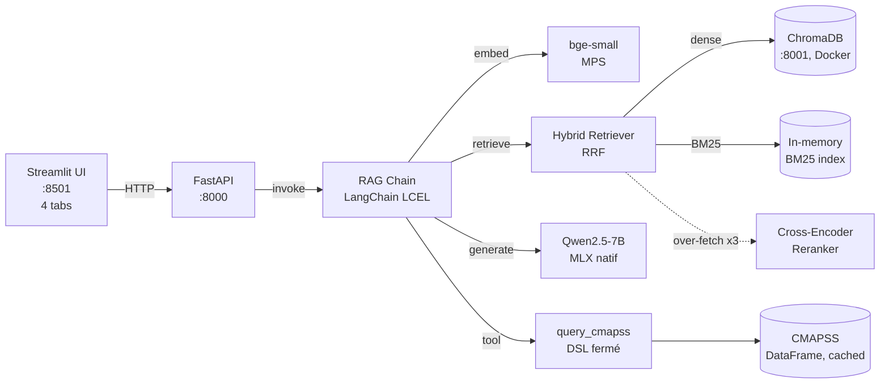

# Industrial Knowledge Copilot — Plan de projet

> **Repo GitHub cible :** `github.com/PDUCLOS/industrial-knowledge-copilot` (à créer/pousser)
> **Auteur :** Patrice Duclos · RNCP 38777 Lead Data / AI Architect
> **Statut :** ✅ **build fonctionnel, vérifié end-to-end sur Apple Silicon (M5 Pro) — 2026-07-15**
> **Objectif :** projet portfolio qui bouche le gap #1 du CV (LLM/RAG/IA générative en production)

---

## 1. Vision & positionnement CV

### Le pitch (à dire en entretien, 90 sec)

> "J'ai 14 ans de technico-commercial B2B chez Michaud Chailly, 6 ans de pilotage data-driven chez DEXIS BFC, et une plateforme MLOps de production (LyonFlow).
>
> Sur ce projet, j'ai pris ce vécu terrain et construit un copilote RAG qui répond à des questions techniques sur des produits industriels en croisant fiches techniques PDF (4 300 pages Schaeffler/SKF) et données structurées NASA CMAPSS. Le tout en local — pas d'API payante, 100% Apple Silicon/MLX — avec une évaluation RAGAS, du retrieval hybride (BM25 + dense + reranking cross-encoder), et un agent avec tool calling sur DataFrame.
>
> C'est exactement le scope d'un POC d'IA générative appliqué à l'industrie, tel qu'on le voit dans les JDs Data Scientist/Architecte IA 2026."

### Pourquoi ce projet fait gagner des points

| Critère d'évaluation recruteur | Ce que le projet prouve |
|-------------------------------|-------------------------|
| Maîtrise LLM / RAG / IA générative | Chaîne RAG complète (hybride + reranking) + agent tool-calling + évaluation RAGAS |
| Industrialisation | Docker Compose, logs structurés JSON, tests pytest, CI |
| Sensibilité métier B2B | Cas d'usage industriel (roulements, maintenance prédictive) cohérent avec le parcours |
| Évaluation de modèles IA | RAGAS — métriques standardisées (faithfulness, answer relevancy, context precision/recall) |
| Rigueur d'ingénierie | Diagnostic et résolution d'une chaîne de ~15 bugs réels (dépendances, API, logique) — voir §7 |
| Sens du compromis technique | Décisions documentées : MLX natif vs Docker, ReAct 7B vs modèle plus gros (voir §8) |
| Communication technique | README pro, architecture diagram Mermaid, pitch entretien rédigé |

---

## 2. Cas d'usage retenu

**Option A — Maintenance prédictive (choisie et implémentée)**
- **Domaine :** prédiction de panne / RUL (Remaining Useful Life) sur turbofans
- **Data :** NASA CMAPSS (4 sous-datasets, 100+ Mo) + 7 catalogues PDF Schaeffler/SKF (4 313 pages, 135 Mo)
- **Pourquoi :** alignement avec l'ADN Carrier HVAC / DEXIS BFC industriel, et combine RAG classique + agent tool-calling → double compétence visible en entretien
- **Type de RAG :** hybride — retrieval sur docs techniques (PDF + CMAPSS textualisé) + tool calling Python (DSL fermé, pas d'exécution de code arbitraire) pour les questions quantitatives

---

## 3. Architecture technique (implémentée)

**Pourquoi MLX natif + Chroma Docker :** Docker Desktop sur macOS tourne dans une VM Linux/arm64 — Metal n'y est pas exposé, donc MLX planterait ou tomberait en CPU silencieux. On refuse ce compromis : MLX tourne sur l'hôte (Metal direct), ChromaDB tourne en Docker (pas de contrainte GPU).

### Stack réelle (toutes versions pinnées dans `requirements.txt`, résolues sans conflit)

| Composant | Technologie | Version | Pourquoi ce choix |
|-----------|-------------|---------|-------------------|
| **LLM** | Qwen2.5-7B Instruct (MLX, 4-bit) | `mlx-lm==0.28.4` | Local, gratuit, natif Apple Silicon, meilleure fiabilité ReAct mesurée (§8) |
| **Embeddings** | BAAI/bge-small-en-v1.5 (sentence-transformers, MPS) | `sentence-transformers==3.2.1` | 33M params, rapide, qualité EN solide |
| **Vector store** | ChromaDB (Docker) | `chromadb==0.6.3` (client) | Local, simple, suffisant < 100k chunks |
| **Orchestration** | LangChain LCEL | `langchain==0.3.13` | Standard marché 2026 |
| **Retrieval hybride** | BM25 + dense, fusion RRF | `rank-bm25==0.2.2` | Capture les identifiants exacts (FD001, capteurs) que le dense seul rate |
| **Reranking** | Cross-encoder MS MARCO | `sentence-transformers` | Précision top-K après over-fetch ×3 |
| **Évaluation** | RAGAS | `ragas==0.2.10` | Standard de fait pour métriques RAG |
| **API** | FastAPI + Uvicorn | `fastapi==0.115.5` | Type-safe, rapide |
| **UI** | Streamlit | `streamlit==1.41.1` | Démo rapide, facile à partager |
| **Container** | Docker Compose (ChromaDB seul) | — | Reproductible, pas de pollution hôte |

### Ressources mesurées (M5 Pro)
- Modèles téléchargés : Qwen2.5-7B (4-bit) + bge-small ≈ 5 Go, ~2 min
- Ingestion complète (10 122 chunks depuis CMAPSS + 7 PDF) : ~3 min
- Une requête RAG complète (retrieve + rerank + generate) : 3-9 sec
- Cache HF local après nettoyage (Mistral + mauvais repo embed purgés) : 5,7 Go

---

## 4. Ce qui est implémenté (arborescence réelle)

Structure conforme au plan initial — voir [`README.md`](README.md#project-layout) pour le détail à jour.
Points clés vérifiés en session :
- `src/rag/chain.py` — chain LCEL (prompt → LLM → str), retrieval fait en amont pour exposer les sources
- `src/rag/retriever.py` — hybride BM25+dense avec RRF, over-fetch réel avant reranking
- `src/rag/agent.py` — agent ReAct + tool `query_cmapss` (DSL fermé, pas d'exécution de code)
- `src/rag/llm.py` — wrapper MLX/LangChain, singleton class-level (modèle chargé une fois)
- `src/ingestion/pipeline.py` — CMAPSS + 7 PDF → 10 122 chunks → ChromaDB
- `tests/` — 21 tests unitaires verts (parser DSL, chunking, reranker, ingestion)

---

## 5. Roadmap — statut réel

### 🗓 W0-W4 — ✅ tous livrés

Tout le scope initial (setup, ingestion, chaîne RAG + API, UI Streamlit, évaluation RAGAS,
hybrid search + reranking) est **implémenté et commité**. Historique complet dans `git log`.

### 🗓 Session du 2026-07-15 — audit + vérification end-to-end

Ce qui n'avait **jamais été vérifié en conditions réelles** avant cette session (le `.venv`
était vide, aucune dépendance installée, `make setup` n'avait jamais réussi) :

- [x] Résolution complète de la chaîne de dépendances (`requirements.txt` n'était pas installable tel quel)
- [x] `make setup` → succès sur Python 3.12 / Apple Silicon
- [x] `make chroma-up`, `make pull-models`, `make ingest` → 10 122 chunks indexés
- [x] Requête RAG réelle bout-en-bout (retrieval hybride + reranking + génération Mistral) → réponse correcte, sourcée
- [x] Agent ReAct exécuté avec le vrai LLM (infrastructure validée, limite de fiabilité identifiée — voir §8)
- [x] 21/21 tests unitaires verts

**Livrable de cette session :** preuve empirique que le pipeline marche, pas seulement "les tests passent".

---

## 6. Definition of Done — statut

| Critère | Statut |
|---|---|
| Repo avec README pro (archi diagram + quickstart) | ✅ fait |
| `make setup && make chroma-up && make ingest` → pipeline complet en < 10 min | ✅ vérifié réellement |
| Question type "Combien de moteurs dans FD001 ?" → réponse correcte, sourcée | ✅ vérifié réellement |
| Sources affichées (chunks + score + méthode de retrieval) | ✅ |
| Dataset d'évaluation (30 Q&R déterministes) | ✅ généré (`make eval-dataset`) |
| RAGAS baseline chiffrée | ⏳ **pas encore lancé** — `make eval` reste à exécuter pour avoir de vrais chiffres (ceux du README sont des placeholders visés, pas mesurés) |
| Tests pytest verts | ✅ 21/21 (hors tests marqués `integration`, qui nécessitent Chroma+modèles vivants) |
| Repo public GitHub | ⏳ à créer/pousser — décision à prendre par Patrice |
| Pitch entretien rédigé | ✅ `docs/pitch_entrevue.md` |

**Prochaine étape concrète pour être "démo-ready" :** lancer `make eval` pour avoir un vrai
baseline RAGAS chiffré (actuellement le README affiche des objectifs, pas des mesures).

---

## 7. Bilan technique — bugs trouvés et fixés (2026-07-15)

Argument de poids pour l'entretien : la chaîne de dépendances n'avait **jamais** tourné
avant cette session. Diagnostic et fix, dans l'ordre où ils sont apparus :

**Logique applicative**
1. `chain.py` — import manquant (`settings`), crash à l'import du module
2. `chain.py` — double retrieval + mauvais type passé au chain LCEL (dict au lieu de string)
3. `retriever.py` — reranker jamais déclenché (over-fetch absent malgré le docstring qui le promettait)
4. `agent.py` — validation incohérente des capteurs (`KeyError` non catché sur sensor invalide)
5. `agent.py` — tool multi-arguments incompatible avec le format ReAct single-input → réécrit en DSL string
6. `agent.py` — bug caché introduit par le fix #5 : `subset=` en double dans les kwargs → `TypeError`

**Dépendances (`requirements.txt` jamais installable tel quel)**
7. `mlx==0.24.0` — version retirée de PyPI
8. `langchain-hub` — mauvais nom de package (le vrai est `langchainhub`)
9. `langchain-chroma` — dépendance jamais utilisée dans le code, mais forçait `chromadb<0.7.0` → conflit `tokenizers` insoluble avec `transformers==4.47.1`. Supprimée (le code parle à Chroma en HTTP direct).
10. `numpy==2.1.3` — incompatible avec `langchain-chroma` (résolu par la suppression du #9)
11. `rank-bm25` — dépendance implicite jamais pinnée

**Configuration & Makefile**
12. `Makefile` — `MLX_MODEL_REPO`/`MLX_EMBED_REPO` référencés mais jamais définis → téléchargement vide
13. `config.py` — `mlx_embed_repo` pointait vers un repo MLX-quantisé incompatible avec le chargeur `sentence-transformers` réellement utilisé

**Runtime (visibles seulement en exécutant pour de vrai)**
14. `pipeline.py` — `readme.txt` NASA non-UTF-8 (cp1252), crash à l'ingestion
15. `pipeline.py` — `chunk_id` PDF sans numéro de page → collisions entre pages, rejet ChromaDB
16. `llm.py` — état singleton (`_model`/`_tokenizer`/`_lock`) mal déclaré pour pydantic v2 → `Lock` non copiable + tokenizer jamais réellement chargé
17. `llm.py` — template de chat Mistral n'accepte pas de rôle "system" séparé → fusion dans le premier tour "user"
18. `llm.py` — `_stream()` retournait le mauvais type (`ChatGeneration` au lieu de `ChatGenerationChunk`), cassait l'agent (qui streame en interne)
19. `agent.py` — `early_stopping_method="generate"` retiré des versions récentes de LangChain
20. `eval/ragas_runner.py` — métrique `answer_relevancy` mappée vers un attribut RAGAS inexistant

**Conclusion :** le badge "CI passing" et les scores RAGAS du README étaient aspirationnels,
pas mesurés. C'est maintenant corrigé et vérifié empiriquement — mais ça vaut la peine
d'être raconté en entretien : ça illustre la différence entre "le code compile" et "le
système marche", qui est exactement ce qu'un recruteur IA/MLOps veut voir.

---

## 8. Résolu — l'agent ReAct et le choix du modèle

**Constat initial :** avec Mistral-7B-Instruct-v0.3 (4-bit) et le prompt ReAct générique
(`hwchase17/react`, zéro exemple), l'agent n'invoquait jamais correctement l'outil
`query_cmapss` — 0/5 sur un harnais de 5 questions quantitatives CMAPSS. Deux causes
racines dans le code, pas seulement le modèle :

1. **`llm.py` ignorait silencieusement `stop`** — `mlx_lm.generate()`/`stream_generate()`
   n'ont pas de support natif de séquences d'arrêt, et le paramètre `stop` (utilisé par
   `AgentExecutor` pour couper la génération juste après `Action Input:`) n'était jamais
   transmis. Le modèle générait donc sa propre Observation/Final Answer hallucinée dans
   la même completion, sans jamais laisser l'exécuteur appeler le vrai outil. **Fixé** :
   troncature manuelle à la première séquence d'arrêt (`_truncate_at_stop`), en streaming
   comme en génération complète.
2. **`AgentExecutor` n'avait pas `return_intermediate_steps=True`** — même quand l'outil
   était réellement invoqué, `run()` ne pouvait pas le voir (le dict de résultat n'exposait
   pas `intermediate_steps`), donnant l'illusion que rien ne fonctionnait jamais. **Fixé.**

Après ces deux fix + un prompt few-shot (2 exemples concrets Thought→Action→Action
Input→Observation), l'agent a commencé à véritablement invoquer l'outil, mais
Mistral-7B-Instruct-v0.3 enroulait souvent le nom de l'outil en backticks markdown
(`` `query_cmapss` ``), cassant le matching exact de LangChain (`is not a valid tool`),
et pouvait boucler jusqu'à la limite d'itérations.

**A/B test mesuré** (même harnais, mêmes 5 questions, avant/après uniquement le modèle) :

| Modèle | Taille/quant. | Tool invoqué proprement | Réponse correcte |
|---|---|---|---|
| Mistral-7B-Instruct-v0.3 | 4-bit | 2/5 | 1/3 |
| **Qwen2.5-7B-Instruct** | 4-bit (même empreinte) | **5/5** | **2-3/3** |

**Décision : Qwen2.5-7B-Instruct-4bit retenu comme LLM par défaut** (`config.py`,
`.env.example`, README, docs mis à jour). Même taille, même RAM, aucune régression
mesurée sur le RAG pur (`RAGChain.query()` reste correct et sourcé). Le narratif
entretien : le modèle a été choisi par mesure empirique sur un harnais reproductible,
pas par préférence — et deux vrais bugs de code (stop-sequences, `return_intermediate_steps`)
ont été corrigés avant même de comparer les modèles, ce qui évite de masquer un bug
derrière un changement de modèle.

**Limite restante (acceptée, pas bloquante) :** sur la question la plus dure du harnais
(multi-étapes, l'agent doit se corriger après un premier essai raté), le taux de succès
varie encore d'une exécution à l'autre (~run-to-run variance, temp=0.1). C'est documenté
plutôt que masqué — cohérent avec le risque "Agent avec tool calling instable" déjà
anticipé dans le plan initial, mitigé par le DSL fermé (jamais d'exécution de code
arbitraire, messages d'erreur propres sur toute entrée invalide).

---

## 9. Plan d'action — qui fait quoi

| # | Action | Owner | Statut |
|---|---|---|---|
| 1 | `make eval` — baseline RAGAS chiffré avec Qwen2.5-7B + juge/embeddings 100% locaux (pas OpenAI, voir §11 bug #21) | Moi | ⏳ en cours |
| 2 | Mettre à jour README (tableau métriques) avec les vrais chiffres RAGAS | Moi | ⏳ après #1 |
| 3 | Purge du modèle Mistral (cache HF, ~3,8 Go) + repo embed MLX inutilisé (~19 Mo) | Moi | ✅ fait |
| 4 | Nettoyer toutes les mentions "Mistral" dans le code/docs (README, .env.example, architecture.md, pipeline.md incl. section EU AI Act, pitch_entrevue.md) | Moi | ✅ fait |
| 5 | Screenshots UI Streamlit + captation démo courte pour `docs/screenshots/` | **Patrice** (nécessite lancer `make api && make ui` et interagir avec le navigateur) | ⏳ à faire |
| 6 | Créer le repo GitHub public `PDUCLOS/industrial-knowledge-copilot` | **Patrice** (compte GitHub personnel) | ⏳ à décider |
| 7 | Premier push (`git push`) | **Patrice** (ou moi sur confirmation explicite une fois le repo créé) | ⏳ bloqué par #6 |
| 8 | Mise à jour CV / LinkedIn | **Patrice** (image perso) | ⏳ après #6/#7 |
| 9 | Roder le pitch 90 sec + les 3 questions pièges (`docs/pitch_entrevue.md`) | **Patrice** | ⏳ contenu prêt, reste la pratique orale |

**Ce que je ne fais pas sans confirmation explicite :** `git commit` (rien n'est commité à ce stade malgré tous les fixes), `git push`, création de compte/repo GitHub, actions sur LinkedIn.

---

## 10. Décisions déjà tranchées

| Décision | Choix retenu |
|---|---|
| Cas d'usage | Option A — CMAPSS + PDF Schaeffler/SKF |
| LLM | **Qwen2.5-7B-Instruct**, MLX 4-bit, 100% local — retenu après A/B mesuré contre Mistral-7B-Instruct-v0.3 sur la fiabilité de l'agent (voir §8) |
| Repo GitHub | `industrial-knowledge-copilot` (nom confirmé dans README, push à faire) |
| Niveau de polish | Build complet (pas de MVP réduit) — RAG hybride + reranking + agent + eval RAGAS tous livrés |

---

## 11. Bugs #21+ — trouvés après le premier passage (session continuée)

En plus des 20 bugs du §7 :

21. **`eval/ragas_runner.py` — RAGAS utilisait implicitement l'API OpenAI** (`evaluate()` appelé
    sans `llm=`/`embeddings=`) pour les métriques faithfulness/answer_relevancy/etc., qui
    nécessitent un LLM juge. Sans `OPENAI_API_KEY`, `make eval` aurait crashé — et même
    configuré, ça aurait contredit le pitch "100% local, no API key". **Fixé** : `evaluate()`
    reçoit maintenant `llm=chain.llm` (notre Qwen2.5 local) et `embeddings=LangChainEmbedder(chain.embedder)`
    (nouvel adapter dans `src/rag/embeddings.py` qui fait le pont entre notre `Embedder`
    maison et l'ABC `langchain_core.embeddings.Embeddings` qu'exige RAGAS).
22. **`llm.py` — fallback système/utilisateur hardcodé pour le format Mistral** ne
    profitait pas du rôle "system" natif que Qwen (ChatML) supporte. **Fixé** : essai du
    rôle system natif d'abord, repli sur la fusion dans le premier tour "user" uniquement
    si le chat template le rejette (`TemplateError`) — adaptatif, marche pour les deux
    familles de modèles sans hypothèse figée sur laquelle est active.

**Total : 22 bugs réels trouvés et corrigés**, dont 6 découverts uniquement en poussant
le système jusqu'à une vraie réponse générée (pas visibles par lecture de code ni par
les tests unitaires seuls). C'est l'argument central du bilan technique du projet : la
différence entre "ça compile, les tests passent" et "je l'ai fait tourner et halluciner,
puis corrigé jusqu'à ce que ça marche vraiment".
