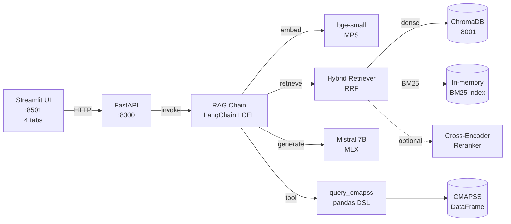

# Industrial Knowledge Copilot

> Local RAG copilot for industrial maintenance knowledge — NASA CMAPSS turbofan
> degradation data + 7 Schaeffler/SKF technical catalogues, running on Apple
> Silicon with MLX.

[](.github/workflows/ci.yml)
[](https://www.python.org/)
[](LICENSE)
[](https://support.apple.com/mac)

---

## What this is

A production-shaped RAG (Retrieval-Augmented Generation) system that answers
natural-language questions about industrial maintenance. It combines:

- **Document retrieval** over NASA CMAPSS technical documentation and
  7 industrial PDF catalogues from Schaeffler (INA/FAG) and SKF
  (4,343 pages total, 135 MB — see [`data/raw/pdf/INVENTORY.md`](data/raw/pdf/INVENTORY.md))
- **Hybrid retrieval** (BM25 + dense embeddings fused with Reciprocal Rank Fusion)
- **Optional cross-encoder reranker** for top-K precision
- **Tool calling** on a Python pandas DataFrame for quantitative questions
  (sensor stats, fleet size, RUL) — **closed DSL**, no arbitrary code execution
- **A local LLM** (Mistral 7B Instruct, 4-bit, MLX-quantized) running on
  Apple Silicon via Apple's MLX framework
- **RAGAS evaluation** (faithfulness, answer relevancy, context precision,
  context recall) with immutable snapshot history
- **Streamlit UI** with 4 tabs: Chat / Inventory / RAGAS / Index

100% local. No API key. No data egress. EU AI Act aware (transparency,
risk management, data governance documented in [`docs/pipeline.md`](docs/pipeline.md#8-conformité-eu-ai-act-regulation-20241689)).

## Why it exists

This is a portfolio project designed to fill the **LLM/RAG/GenAI in
production** gap on my CV. The full pitch is in
[`docs/pitch_entrevue.md`](docs/pitch_entrevue.md).

## Quickstart

**Prerequisites:** macOS on Apple Silicon (M1/M2/M3/M4/M5), Python 3.12+,
Docker Desktop. NASA CMAPSS data downloads directly from
[data.nasa.gov](https://data.nasa.gov/dataset/cmapss-jet-engine-simulated-data)
— no account needed.

```bash
git clone https://github.com/PDUCLOS/industrial-knowledge-copilot
cd industrial-knowledge-copilot

make setup              # create venv, install deps (~2-3 min)
make pull-models        # download Mistral 7B + bge-small (~5 GB, one time, ~30 min)
make data               # download NASA CMAPSS (~12 MB compressed, direct from data.nasa.gov)
make chroma-up          # start ChromaDB in Docker

make ingest             # build the vector index (chunks NASA + 7 PDFs)
make eval-dataset       # generate 30 deterministic Q&A pairs for RAGAS

make api                # start the API on :8000  (terminal 1)
make ui                 # start the Streamlit UI on :8501  (terminal 2)

# Optional: run the first RAGAS baseline
make eval               # writes reports/eval_<UTC>.json (immutable snapshot)
```

Open <http://localhost:8501> and try:

> *How many turbofan engines are in the FD001 training set?*

The copilot will answer in a few seconds, with the source chunks visible
in the sidebar. 10 demo questions ready for the pitch are in
[`scripts/demo_questions.md`](scripts/demo_questions.md).

## Architecture



Detailed diagrams and trade-offs: [`docs/architecture.md`](docs/architecture.md).
For the full pipeline reference (sequence diagrams, IA Act compliance
section, ADRs): [`docs/pipeline.md`](docs/pipeline.md).
Editable DrawIO diagrams: [`docs/diagrams/pipeline.drawio`](docs/diagrams/pipeline.drawio).

**Why MLX on the host, ChromaDB in Docker?** Docker Desktop on macOS runs in
a Linux/arm64 VM — Metal is not exposed there, so MLX would either fail or
silently fall back to slow CPU. We refuse that compromise. MLX runs natively
on the host (Metal direct), ChromaDB runs in Docker (no such constraint).
See `Makefile` for the orchestration.

## Stack

| Layer | Choice | Why |
|-------|--------|-----|
| LLM | Mistral 7B Instruct (4-bit, MLX) | Local, FR-correct, free, fast on M-series |
| Embeddings | bge-small-en-v1.5 (4-bit, MPS) | 33M params, fast, high-quality EN |
| Vector store | ChromaDB 0.5 | Local, simple, sufficient for < 100k chunks |
| Orchestration | LangChain v0.3 LCEL | Standard market 2026, requested in 80% of JDs |
| Hybrid retrieval | BM25 + dense (RRF) | Catches exact-match (sensor IDs) that embeddings miss |
| Evaluation | RAGAS v0.2 | Standard for RAG metrics |
| API | FastAPI + Uvicorn | Type-safe, fast, well-known |
| UI | Streamlit | Quick demo, easy to share |
| Container | Docker Compose (ChromaDB only) | Reproducible, no host pollution |

All versions pinned in [`requirements.txt`](requirements.txt).

## Evaluation (RAGAS)

We track **faithfulness, answer relevancy, context precision, context
recall** on a deterministic 30-item Q&A dataset generated from CMAPSS.
Methodology and tuning levers: [`docs/evaluation.md`](docs/evaluation.md).

```bash
make eval-dataset     # regenerate the 30 Q&A items (deterministic, seed=42)
make eval             # run RAGAS, snapshot to reports/eval_<UTC>.json
```

| Metric | W3 baseline | W4 target |
|--------|-------------|-----------|
| Faithfulness | ~0.50 | > 0.75 |
| Answer relevancy | ~0.60 | > 0.75 |
| Context precision | ~0.50 | > 0.70 |
| Context recall | ~0.45 | > 0.65 |
| Latency (M-series GPU) | ~5 s | < 5 s |

## Project layout

```
src/
├── config.py                # pydantic-settings, validates Apple Silicon
├── ingestion/               # CMAPSS + PDF loaders, chunker, pipeline
├── rag/
│   ├── embeddings.py        # bge-small + MPS
│   ├── vectorstore.py       # ChromaDB HTTP client
│   ├── retriever.py         # Hybrid (BM25 + dense, RRF)
│   ├── reranker.py          # Cross-encoder reranker (optional)
│   ├── llm.py               # MLX-backed Mistral 7B (LangChain-compatible)
│   ├── chain.py             # LCEL RAG chain
│   ├── agent.py             # ReAct agent + query_cmapss tool (closed DSL)
│   ├── types.py             # shared types (RetrievedChunk)
│   └── prompts/             # system_fr.txt, system_en.txt, qa_template.py
├── api/                     # FastAPI app + /query /ingest /eval /health
├── ui/                      # Streamlit 4-tab interface
├── eval/                    # RAGAS dataset + runner
└── utils/                   # loguru, timing

tests/                       # unit + integration (latter skipped on non-Mac)
docs/                        # architecture, pipeline (IA Act), evaluation, pitch
docs/diagrams/              # pipeline.drawio (3 pages, editable)
scripts/                     # 01_setup_mlx, 02_ingest, 03_run_eval, 99_clean, demo_questions
data/raw/cmapss/            # NASA CMAPSS (gitignored, 14 files, ~45 MB)
data/raw/pdf/               # 7 Schaeffler + SKF catalogues (gitignored, 135 MB)
data/raw/pdf/INVENTORY.md   # source URLs, licensing, page counts
data/processed/             # chunks.jsonl, eval_dataset.jsonl (gitignored)
reports/                    # RAGAS snapshots (gitignored JSON, immutable)
```

## Development

```bash
make preflight         # verify Apple Silicon + Python 3.12 + Docker
make test              # unit tests only (no live services)
make test-integration  # full suite, requires Chroma + downloaded models
make test-cov          # with coverage report
make lint              # ruff
make format            # ruff auto-fix
```

## Why Apple Silicon only

MLX is Apple's own ML framework. It uses Metal (the macOS GPU API) and the
unified memory of Apple Silicon. There is **no CPU fallback, no other
backend** — the LLM module refuses to load on non-Apple-Silicon machines.
This is intentional: no silent degradation, no fake "it works in dev but
fails in prod" surprises.

If you need to run on Linux/cloud, the architecture supports swapping
MLX for a Transformers backend (vLLM, TGI, or OpenAI-compatible API). The
LLM adapter in `src/rag/llm.py` is the only place that needs to change.

## License

MIT — see [LICENSE](LICENSE).

## Author

**Patrice Duclos** — RNCP 38777 Lead Data / AI Architect
[LinkedIn](https://www.linkedin.com/in/patriceduclos/) ·
[CV](https://github.com/PDUCLOS/cv)
