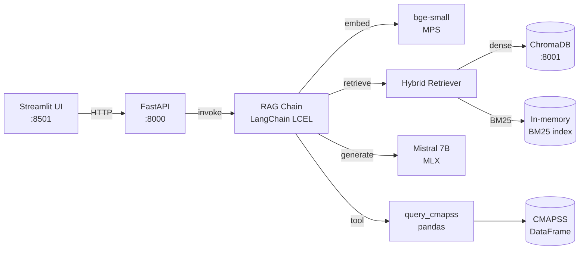

# Architecture

## Overview

The Industrial Knowledge Copilot is a local RAG (Retrieval-Augmented
Generation) system. It answers natural-language questions about industrial
maintenance by combining:

1. **Document retrieval** over NASA CMAPSS documentation + technical PDFs
   (chunked + embedded in a vector store)
2. **Tool calling** on a Python pandas DataFrame for quantitative questions
   (mean RUL, sensor stats, fleet size, etc.)
3. **A local LLM** (Mistral 7B Instruct, 4-bit MLX-quantized) running on
   Apple Silicon via Apple's MLX framework

All inference is local. No data leaves the machine. The only network
egress is the one-time download of the NASA CMAPSS dataset and the MLX
model weights from HuggingFace.

## Why MLX, why Apple Silicon

The user requirement is a project that runs on a MacBook Pro M5 Pro with
Metal GPU acceleration. Apple MLX is the framework with the best
Metal/Metal Performance Shaders (MPS) integration as of 2026:

- **Mistral 7B Instruct (4-bit)**: ~4.5 GB on disk, ~5 GB RAM at inference,
  2–5 s/query on M-series with Metal
- **bge-small embeddings (4-bit)**: 33M params, 384-dim, fast on MPS
- **No GPU/CPU split**: MLX uses the unified memory of Apple Silicon, so
  we don't have to manage device placement

The trade-off: MLX is Apple-only. The CI runs a subset of tests (no
inference), and the API exposes a `/health` endpoint that warns when run
on non-Apple-Silicon hardware.

## Why hybrid retrieval (BM25 + dense)

The CMAPSS readme and PDF catalogues are dense prose, but exact-match
queries on identifiers (`FD001`, `sensor_11`, `unit_5`) are common. Pure
embedding retrieval misses those. We combine:

- **Dense retrieval** (sentence-transformers bge-small, cosine) — semantic
- **Lexical retrieval** (BM25, in-memory) — exact match
- **Reciprocal Rank Fusion (RRF)** — combines the two rankings without
  requiring score calibration

## Components

### Why ChromaDB in Docker, MLX on the host

Docker Desktop on macOS runs in a Linux/arm64 VM. Metal is not exposed to
that VM, so MLX inside Docker would either fail or fall back to slow CPU
inference. The compromise we make is **architectural honesty**:

- ChromaDB has no such constraint → it runs fine in Docker
- MLX LLM and embeddings → run natively on the host (Metal direct)
- FastAPI and Streamlit → on the host (so they can call MLX)

The `Makefile` orchestrates the whole thing. The `Dockerfile` is kept
for CI (Linux) and future cloud-deploy scenarios.

## Data flow

### Ingestion (one-shot per rebuild)

1. `cmapss_loader.load_train(subset)` → `pandas.DataFrame`
2. `_dataframe_to_text(df, subset)` → human-readable text block per subset
3. `pdf_loader.load_pdf(path)` → `list[PdfPage]`
4. `chunker.build_chunks([...])` → `list[Chunk]`
5. `embedder.embed([c.text for c in chunks])` → `list[list[float]]`
6. `vectorstore.upsert(chunks, vectors)` → Chroma collection
7. `chunks.jsonl` → audit trail on disk

### Query (per request)

1. UI sends `POST /query {question, top_k}`
2. API calls `RAGChain.get().query(question, top_k)`
3. Chain embeds the question, retrieves top-k chunks (RRF), formats
   context, calls LLM with system prompt + question + context
4. Returns `{answer, sources, latency_ms}`

### Evaluation (per release)

1. `make eval-dataset` regenerates 30 Q&A pairs from CMAPSS
2. `make eval` runs the RAG chain on every question, feeds into RAGAS
3. RAGAS computes faithfulness, answer_relevancy, context_precision,
   context_recall
4. Snapshot saved to `reports/eval_<UTC-timestamp>.json`

## Trade-offs and known limitations

| Decision | Why | When to revisit |
|----------|-----|-----------------|
| Mistral 7B (4-bit) | Fast, FR-correct, free, local | If RAGAS faithfulness < 0.7 — try Mistral 7B v0.3 or Llama-3 8B |
| bge-small (EN, 33M) | Fast, good EN quality | If multi-lingual PDF support needed — switch to bge-m3 or nomic-embed |
| BM25 in-memory | Cheap, fits < 5k chunks | If collection > 100k chunks — use a persistent BM25 (e.g. pyserini) |
| Reciprocal Rank Fusion | No score calibration needed | If RAGAS context_precision < 0.7 — try Cross-Encoder reranking |
| 1 Python tool (closed DSL) | Prevents runaway code | If users need more flexibility — add `query_pandas(operation="...")` whitelist |
| ChromaDB in Docker | Simplest ops | If we need < 10 ms retrieval — switch to Qdrant or pgvector |
| Apple Silicon only | Best Metal perf, no API cost | If cross-platform needed — add an OpenAI/Anthropic backend toggle |
